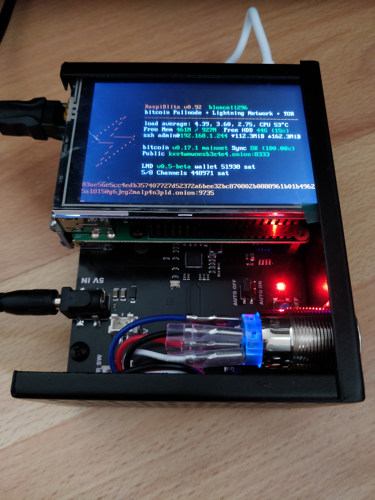

## Make your Full Node work
Get the most value out of your dedicated hardware

start at https://github.com/rootzoll/raspiblitz

and continue https://github.com/Stadicus/guides/blob/master/raspibolt/raspibolt_60_bonus.md

More here:

* #### [Connect the Zeus Lightning Wallet on Android to the RaspiBlitz over Tor](Zeus_to_RaspiBlitz_through_Tor.md)

* #### [Set up SSL acces for the Ride The Lightning web UI on the RaspiBlitz](nginx/README.md)

* #### [Install the Electrum Server in Rust (electrs) on the RaspiBlitz and set it up as the backend of the Eclair wallet](electrs/README.md)

    \`The server indexes the entire Bitcoin blockchain, and the resulting index enables fast queries for any given user wallet, allowing the user to keep real-time track of his balances and his transaction history using the Electrum wallet. Since it runs on the user's own machine, there is no need for the wallet to communicate with external Electrum servers, thus preserving the privacy of the user's addresses and balances.\` - https://github.com/romanz/electrs

* #### [Install OpenBazaar on a RaspiBlitz, install OpenBazaar client and migrate the store contents](https://gist.github.com/openoms/ba843f7c44ff9c7ca0b5a80e12a0aeb4)
    Truly decentralized, peer-to-peer ecommerce - https://openbazaar.org/

* #### [Connect the Zap Desktop Lightning wallet to the RaspiBlitz](ZAPtoRaspiBolt/README.md)  
    The desktop app ZAP (https://github.com/LN-Zap/zap-desktop) ) is a cross platform Lightning Network wallet focused on user experience and ease of use.

* #### [Connect the Joule browser extension to the RaspiBlitz](JouleToRaspiBlitz.md) 
    https://lightningjoule.com/
    Bring the power of lightning to the web with in-browser payments and identity, all with your own node.

* #### [Install Electrum with support for ColdCard, Trezor and Ledger](Electrum_ColdCard_Trezor_Ledger_EPS.md)

---

#### See my Lightning node on 1ML and connect: https://1ml.com/node/028a2cb8d51e44d7d7e108c2e80a98cc069145e05a6d2025cf554bd8866fe32993
If you are not behind Tor send me a DM on https://twitter.com/openoms an I will add you as a peer first.

