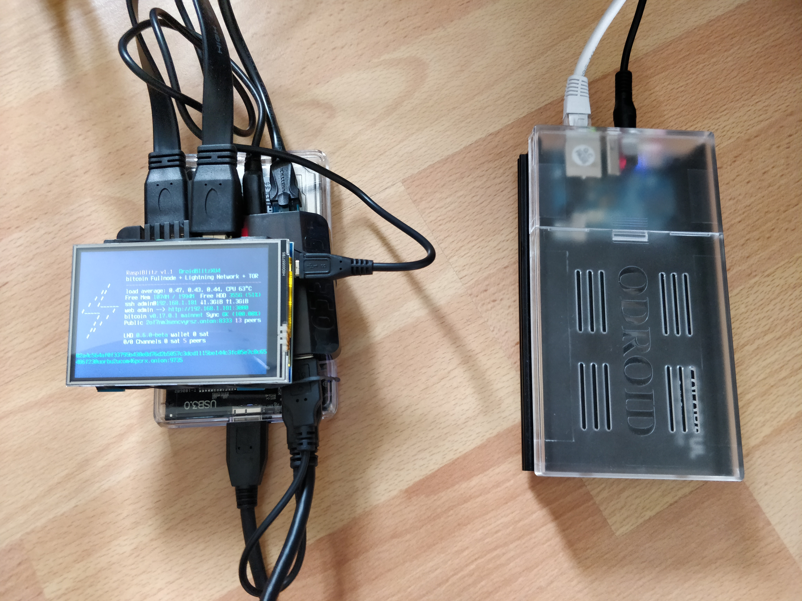

## Automated guides for RaspiBlitz, RaspiBolt, Thundroid and Ubuntu Linux desktop
Get the most use out of your Bitcoin Full Node

start at https://github.com/rootzoll/raspiblitz

and continue https://stadicus.github.io/RaspiBolt/raspibolt_60_bonus.html

More here:

* #### [RaspiBlitz: install the Electrum Server in Rust (electrs) and set it up to connect over SSL](electrs/README.md)
    Can be used as the backend of:
    * Eclair Mobile Bitcoin and Ligthtning wallet
    * Electrum wallet

    \`The server indexes the entire Bitcoin blockchain, and the resulting index enables fast queries for any given user wallet, allowing the user to keep real-time track of his balances and his transaction history using the Electrum wallet. Since it runs on the user's own machine, there is no need for the wallet to communicate with external Electrum servers, thus preserving the privacy of the user's addresses and balances.\` - https://github.com/romanz/electrs

* #### [RaspiBlitz: SSL/HTTPS access for the Ride The Lightning web UI](nginx/README.md)

* #### [RaspiBlitz: Connect the Zeus Lightning Wallet on Android to the RaspiBlitz over Tor](Zeus_to_RaspiBlitz_through_Tor.md)

* #### [Set up the RaspiBlitz for remote connections with ZeroTier](zerotier/README.md)

    ZeroTier is a VPN service which is an easy option to connect remotely when neither port forwarding nor using Tor is possible (e.g. iOS on a remote network)
    The drawback is that it requires installing a trusted package which gives access to your private network.

* #### [RaspiBlitz: update LND to v0.7.0-beta-rc2](lnd.update.v0.7.0-beta-rc2.sh)
    Download and run the script to update:  
    `$ wget https://raw.githubusercontent.com/openoms/bitcoin-tutorials/master/lnd.update.v0.7.0-beta-rc2.sh && sudo bash lnd.update.v0.7.0-beta-rc2.sh`

* #### [RaspiBlitz: build LND from source](lnd.from.source.sh)
    Download and run this script on the RaspiBlitz:  
    `$ wget https://raw.githubusercontent.com/openoms/bitcoin-tutorials/master/lnd.from.source.sh && sudo bash lnd.from.source.sh`

    Will ask for the commit to checkout from.
    Choose a commit ID from this list: https://github.com/lightningnetwork/lnd/commits/master

* #### [RaspiBlitz: Connect the Zap Desktop Lightning wallet](ZAPtoRaspiBolt/README.md)  
    The desktop app ZAP (https://github.com/LN-Zap/zap-desktop) ) is a cross platform Lightning Network wallet focused on user experience and ease of use.

* #### [RaspiBlitz: Connect the Joule browser extension](JouleToRaspiBlitz.md) 
    https://lightningjoule.com/
    Bring the power of lightning to the web with in-browser payments and identity, all with your own node.

* #### [Linux Desktop: Install Electrum with support for ColdCard, Trezor and Ledger](Electrum_ColdCard_Trezor_Ledger_EPS.md)

* #### [RaspiBlitz: Install OpenBazaar, Linux Desktop: install OpenBazaar client and migrate the store contents](https://gist.github.com/openoms/ba843f7c44ff9c7ca0b5a80e12a0aeb4)
    Truly decentralized, peer-to-peer ecommerce - https://openbazaar.org/

---

#### See my Lightning node on 1ML and connect: https://1ml.com/node/028a2cb8d51e44d7d7e108c2e80a98cc069145e05a6d2025cf554bd8866fe32993
If your node is not behind Tor send me a DM on https://twitter.com/openoms and will add you as a peer first.

