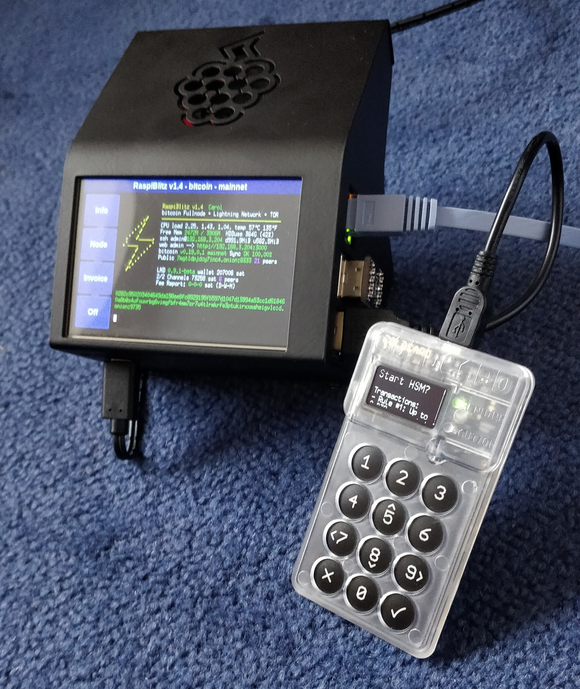
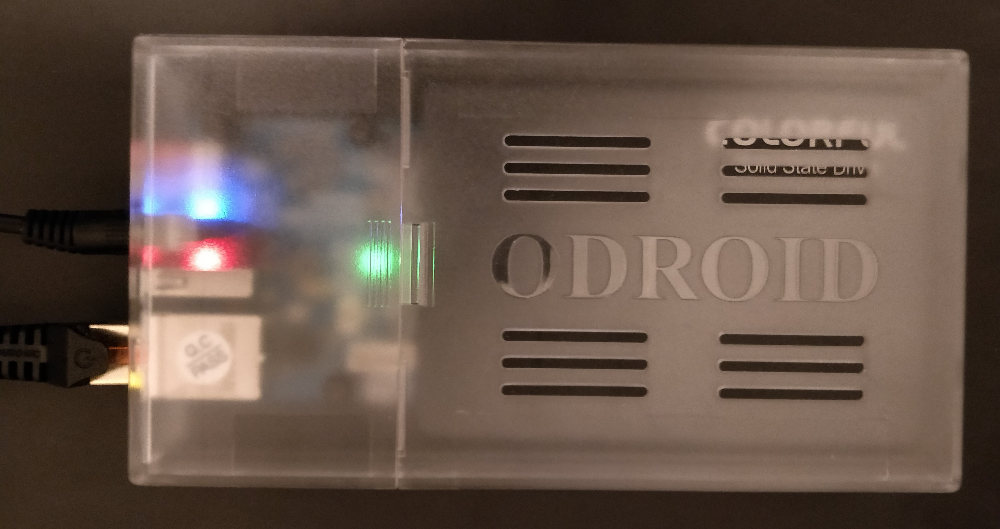
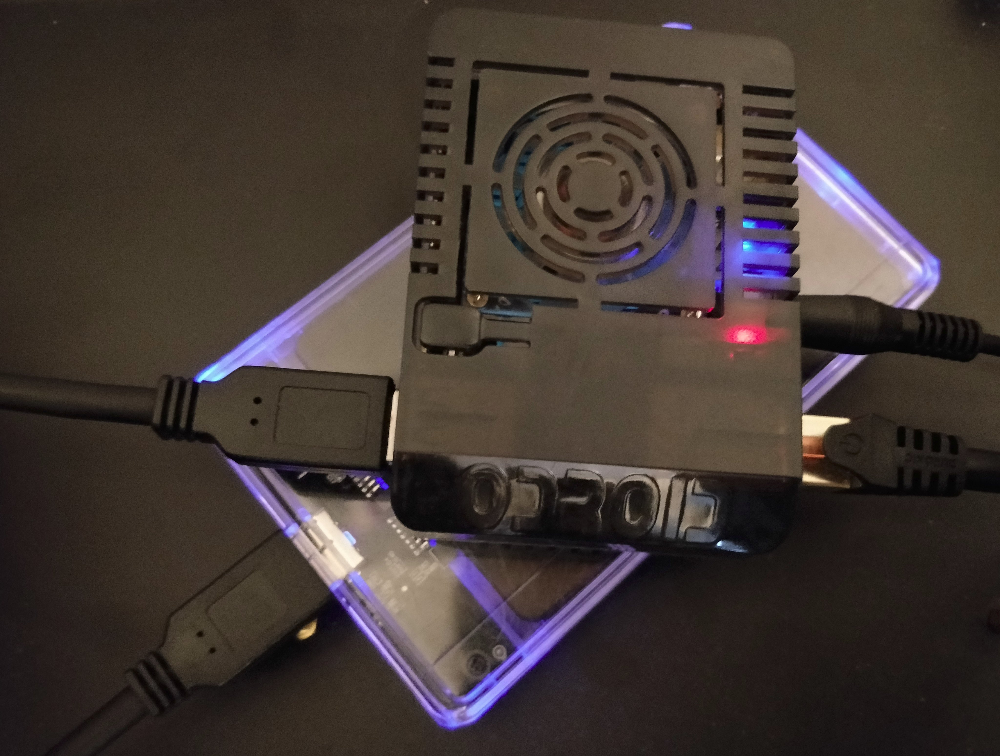

## Guides for the RaspiBlitz and Linux desktop

Start at <https://github.com/rootzoll/raspiblitz>
* #### [Phone as a wallet](phonewallet.md)
    A guide to store bitcoin on a clean Android or iPhone secured with multisignature in the Blockstream Green Wallet.  
    Recommendations to people who are looking into how to take custody of their first satoshis and not running their own node yet.
* #### [Single seed multi-location backup schemes](backups/README.md)
    Create 3 packages of cryptographically secure backups where the funds cannot be recovered from any single package, but can be recovered with the combination of any two. Can be thought of as a physical 2-of-3 multisig solution for ColdCard, JoinMarket and LND wallets.
* #### [Forward ports with a reverse SSH tunnel](ssh_tunnel.md)
    No port forwarding needed on the local router.
    Hides the IP of the host and provides an encrypted connection. 
* #### [Tor-to-IP tunnel service](tor2ip_tunnel.md)
     Use the public IP address of a Virtual Private Server (VPS) to make Tor Hidden Services reachable on the clearnet.
* #### [Create a Tor Hidden Service](tor_hidden_service_example.md)
    A simple example of creating and using a Tor Hidden Service.
* #### [ZeroTier remote access](zerotier/README.md)
    ZeroTier is a VPN service which is an easy option to connect remotely when neither port forwarding nor using Tor is possible (e.g. iOS on a remote network)
    The drawback is that it requires installing a trusted package which gives access to your private network.
* #### [CoinKite Bunker on the RaspiBlitz](ckbunker_on_blitz.md)
    <p align="left">
    
    </p>
* #### [Connect JoinMarket running on a Linux desktop to a remote node](joinmarket/joinmarket_desktop_to_blitz.md)
    In order to use the JoinMarketQT GUI (and other scripts) it needs to connect to a Bitcoin Core node. A pruned node with the wallet enabled will do and txindex is not required.
* #### [JoinMarket on the RaspiBlitz](joinmarket/README.md)
    A long standing coinjoin implementation with decentralised coordination and incentive structure.
* #### [BTCPayServer on the RaspiBlitz](BTCPayServer/README.md)
    This guide will make you have BTCPayServer running on your node using the already synced bitcoin blockchain and local LND node and benefit from the backup and security features of RaspiBlitz and the stock LND.  
    No added synchronization needed. 
* #### [Electrum wallet](electrs/electrum_wallet.sh)
    Download, verify and install the chosen version on a Linux desktop.
    ```
    # download
    wget https://raw.githubusercontent.com/openoms/bitcoin-tutorials/master/electrs/electrum_wallet.sh 
    # inspect the script
    cat electrum_wallet.sh
    # run
    bash electrum_wallet.sh
    ```
* #### [Electrum Server in Rust (electrs) on the RaspiBlitz](electrs/README.md)
    Can be used as the backend of:
    * Blue wallet
    * Phoenix / Eclair Mobile Bitcoin and Ligthtning wallet
    * Electrum wallet
    * BitBoxApp

    \`The server indexes the entire Bitcoin blockchain, and the resulting index enables fast queries for any given user wallet, allowing the user to keep real-time track of his balances and his transaction history using the Electrum wallet. Since it runs on the user's own machine, there is no need for the wallet to communicate with external Electrum servers, thus preserving the privacy of the user's addresses and balances.\` - <https://github.com/romanz/electrs>

* #### [Electrum wallet installation on Linux with support for ColdCard, Trezor and Ledger](Electrum_ColdCard_Trezor_Ledger_EPS.md)

* #### [Zap iOS Tor Connection](Zap_to_RaspiBlitz_through_Tor.md)
    Remote wallet for LND connected through Tor on iOS TestFlight
    
* #### [ZeusLN Android Tor connection](Zeus_to_RaspiBlitz_through_Tor.md)
    Remote wallet for LND connected through Tor on Android

* #### [RTL SSL/HTTPS access](nginx/README.md)
    Secure remote connection for the Ride the Lightning Web UI

* #### [Zap Desktop Lightning wallet connection](ZAPtoRaspiBolt/README.md)  
    The desktop app [ZAP](https://github.com/LN-Zap/zap-desktop) is a cross platform Lightning Network wallet focused on user experience and ease of use.

* #### [Joule browser extension](JouleToRaspiBlitz.md) 
    Bring the power of lightning to the web with in-browser payments and identity, all with your own node. <https://lightningjoule.com/>

* #### [OpenBazaar installation and store migration](https://gist.github.com/openoms/ba843f7c44ff9c7ca0b5a80e12a0aeb4)
    Truly decentralized, peer-to-peer ecommerce - https://openbazaar.org/

* ####  [RaspiBlitz updates](raspiblitz.updates/README.md)
    Update scripts for the RaspiBlitz and compatible systems.

* #### [LND updates](https://github.com/openoms/lightning-node-management/blob/master/lnd.updates/README.md)
    Scripts to download, verify and update LND to the latest release or build from source up to a chosen commit.
---

* #### [RaspiBlitz v1.3 SDcard image for the Odroid HC1/HC2/XU4/XU4Q](https://github.com/openoms/raspiblitz/releases/tag/v1.3)
    Based on the RaspiBlitz v1.3 and contains:
    * armbian 5.95
    * LND v0.7.1-beta 
    * Bitcoin Core v0.18.1

<p align="left">
  
  
</p>
