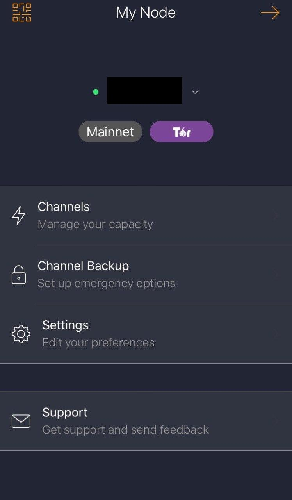

# WARNING: Zap iOS is unmaintained, use desktop or Android version. Zeus works on iOS.
# Connect Zap over Tor to the RaspiBlitz

<p align="left">
  
</p>

## Use the MOBILE menu on the RaspiBlitz for QR codes on the display and/or in the terminal.

## Manual process

### Create the Hidden Service:
* In the RaspiBlitz terminal:  

    `$ sudo nano /etc/tor/torrc`

* paste on the end of the file
    ```
    HiddenServiceDir /mnt/hdd/tor/lnd_REST/
    HiddenServiceVersion 3
    HiddenServicePort 8080 127.0.0.1:8080
    ```

    Save (Ctrl+O, ENTER) and exit (Ctrl+X)

    If you want to use a different port:
    ```
    HiddenServicePort THIS_CAN_BE_ANY_PORT 127.0.0.1:8080
    ```

* Restart Tor:  

    `$ sudo systemctl restart tor`
    
* Take note of the `HIDDEN_SERVICE_ADDRESS.onion`:

    `$ sudo cat /mnt/hdd/tor/lnd_REST/hostname`
    
    example output:
    ```
    32zzibxmqi2ybxpqyggwwuwz7a3lbvtzoloti7cxoevyvijexvgsfeid.onion
    ```

### Install lndconnect

* Install Go and the latest lndconnect manually:

    ```
    # check if  Go is installed (should be v1.11 or higher):  
    go version 
    # If need to install Go, run these:
    wget https://storage.googleapis.com/golang/go1.13.linux-armv6l.tar.gz
    sudo tar -C /usr/local -xzf go1.13.linux-armv6l.tar.gz
    sudo rm *.gz
    sudo mkdir /usr/local/gocode
    sudo chmod 777 /usr/local/gocode
    export GOROOT=/usr/local/go
    export PATH=$PATH:$GOROOT/bin
    export GOPATH=/usr/local/gocode
    export PATH=$PATH:$GOPATH/bin
    # make the path persist
    sudo bash -c "echo 'PATH=\$PATH:/usr/local/gocode/bin/' >> /etc/profile"

    # Install lndconnect from source:
    go get -d github.com/LN-Zap/lndconnect
    cd $GOPATH/src/github.com/LN-Zap/lndconnect
    make
    ```

### Generate the lndconnect string
* Run lndconnect with the `HIDDEN_SERVICE_ADDRESS.onion` filled in:  
`lndconnect --host=HIDDEN_SERVICE_ADDRESS.onion --port=8080 --nocert`
  
  Example:  
  `lndconnect --host=32zzibxmqi2ybxpqyggwwuwz7a3lbvtzoloti7cxoevyvijexvgsfeid.onion --port=8080 --nocert`

    
    Maximise the window and reduce the text size to fit the screen.   
    Use CTRL + - or the middle mouse wheel on Windows.


* Alternatively run lndconnect with the -j option to display the text string:  
`lndconnect --host=HIDDEN_SERVICE_ADDRESS.onion --port=8080 --nocert -j`

    The correct string format is:
    ```
    lndconnect://HIDDEN_SERVICE_ADDRESS.onion:8080?macaroon=<base64adminmacaroon>
    ```

### Connect Zap through Tor
* Scan the QR code with your Tor enabled Zap  

    or

* Share the string to your phone in an encrypted chat message to yourself and paste the string into Zap 

* Enjoy your private and encrypted remote connection!

<p align="left">
  
</p>
