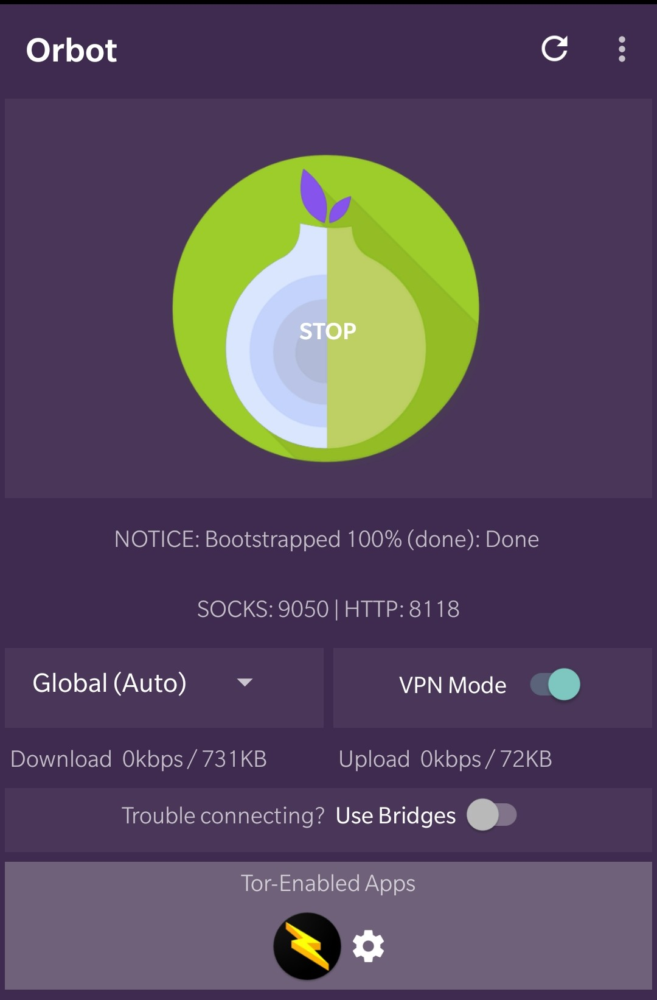
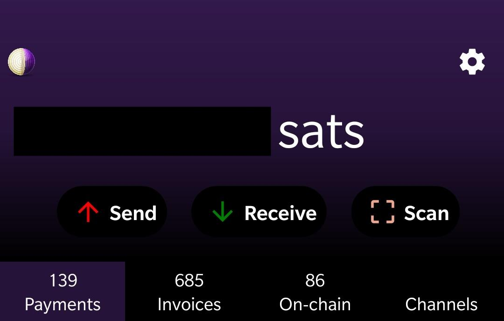

# Connect Zeus over Tor to the RaspiBlitz

<p align="left">
  
</p>

Zeus v0.5.0 has native Tor support on both iOS and Android (can forget Orbot)!

Get the test versions from https://t.me/zeusLN or https://twitter.com/ZeusLN.  
Tested on the RaspiBlitz v1.6.3 with Tor activated.

Download the [Zeus](https://zeusln.app/) app.  
Available on:
* [GitHub](https://github.com/ZeusLN/zeus/releases), 
* [F-Droid](https://f-droid.org/en/packages/com.zeusln.zeus/) 
* [Google Play](https://play.google.com/store/apps/details?id=com.zeusln.zeus)
* [iOS TestFlight](https://testflight.apple.com/join/gpVFzEHN)


Display a QR code with the Tor connection details on the LCD and the terminal:
```bash
$ config.scripts/bonus.lndconnect.sh zeus-android tor
```
same for iOS and Android shows the QR with a v2 Tor address (to reduce the size of the QR code). The v3 onion address is preferred because it is not brute-forceable or guessable.

After the dependencies have been installed with the script above a QRcode with a v3 address can be displayed in the terminal with:
```bash
$ lndconnect --host=$(sudo cat /mnt/hdd/tor/lndrest8080/hostname) --port=8080
```

If the QRcode does not fit the terminal generate a the lndconnect string by adding the `-j` option:
```bash
$ lndconnect --host=$(sudo cat /mnt/hdd/tor/lndrest8080/hostname) --port=8080 -j
```
use a local QRcode generator to display the image (never paste the string into a website).  
A list of open-source QRcode generators for Windows:
<https://listoffreeware.com/open-source-qr-code-generator-software-windows/>


---
## Deprecated manual instructions:

Tested on the RaspiBlitz v1.3 with Tor activated.
### Create the Hidden Service:
* In the RaspiBlitz terminal:  

    `$ sudo nano /etc/tor/torrc`

* paste on the end of the file:
    ```
    HiddenServiceDir /mnt/hdd/tor/lnd_REST/
    HiddenServiceVersion 3
    HiddenServicePort 8080 127.0.0.1:8080
    ```
    Save (Ctrl+O, ENTER) and exit (Ctrl+X)

    If you want to use a different port:
    ```
    HiddenServicePort THIS_CAN_BE_ANY_PORT 127.0.0.1:8080
    ```
* Restart Tor:

    `$ sudo systemctl restart tor` 

* Take note of the HIDDEN_SERVICE_ADDRESS.onion:

    `$ sudo cat /mnt/hdd/tor/lnd_REST/hostname`
    
    Example output:  
    ```
    32zzibxmqi2ybxpqyggwwuwz7a3lbvtzoloti7cxoevyvijexvgsfeid.onion
    ```

### Install lndconnect 

* Install Go and the latest lndconnect manually:

    ```
    # check if  Go is installed (should be v1.11 or higher):  
    go version 
    # If need to install Go, run these:
    wget https://storage.googleapis.com/golang/go1.13.linux-armv6l.tar.gz
    sudo tar -C /usr/local -xzf go1.13.linux-armv6l.tar.gz
    sudo rm *.gz
    sudo mkdir /usr/local/gocode
    sudo chmod 777 /usr/local/gocode
    export GOROOT=/usr/local/go
    export PATH=$PATH:$GOROOT/bin
    export GOPATH=/usr/local/gocode
    export PATH=$PATH:$GOPATH/bin
    # make the path persist
    sudo bash -c "echo 'PATH=\$PATH:/usr/local/gocode/bin/' >> /etc/profile"

    # Install lndconnect from source:
    go get -d github.com/LN-Zap/lndconnect
    cd $GOPATH/src/github.com/LN-Zap/lndconnect
    make
    ```
### Generate the lndconnect string
* Run lndconnect with the HIDDEN_SERVICE_ADDRESS.onion filled in:  

    `$ lndconnect --host=HIDDEN_SERVICE_ADDRESS.onion --port=8080`
    
    Example:  
    
    `lndconnect --host=32zzibxmqi2ybxpqyggwwuwz7a3lbvtzoloti7cxoevyvijexvgsfeid.onion --port=8080`

    Maximise the window and reduce the text size to fit the screen.   
    Use CTRL + - or the middle mouse wheel on Windows.

### Set up [Orbot](https://guardianproject.info/apps/orbot/ )
Available on
* [F-Droid](https://guardianproject.info/fdroid) 
* [Google Play](https://market.android.com/details?id=org.torproject.android)
* [Direct link](https://guardianproject.info/releases/orbot-latest.apk)

On Orbot's main screen select the gear icon under `tor enabled apps`.  
Add `Zeus`, then press back.  
Click `STOP` on the big onion logo.  
Exit Orbot and reopen it. Turn on `VPN Mode`.  
Start your connection to the Tor network by clicking on the big onion (if it has not automatically connected already)

If Orbot is misbehaving try stopping other VPN services on the phone and/or restart.

To open Zeus click on it's icon at the `Tor_Enabled-Apps`:

<p align="left">
  
</p>

### Connect Zeus
* Scan the QR code with your Zeus  
* Enjoy your private and encrypted remote connection!

<p align="left">
  
</p>

SEND SATOSHIS PRIVATELY!  
Get that beautiful onion png in the top left of Zeus.  
Self Sovereignty for the streets!

### Resources:

* this guide is based on: <https://github.com/seth586/guides/blob/master/FreeNAS/wallets/zeusln.md>

* Have a look at the proposal of @seth586 about connecting light wallets through Tor: <https://medium.com/@seth586/neutrino-can-be-dangerous-so-lets-grow-bitcoins-immunity-with-a-bip-bolt-2135956f147>


