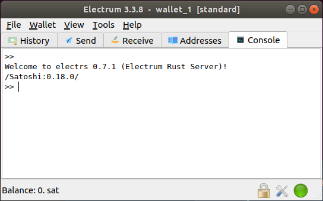
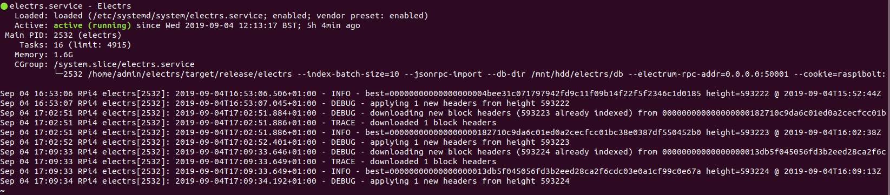

# Electrum Server in Rust (electrs) setup on the RaspiBlitz

\`The server indexes the entire Bitcoin blockchain, and the resulting index enables fast queries for any given user wallet, allowing the user to keep real-time track of his balances and his transaction history using the Electrum wallet. Since it runs on the user's own machine, there is no need for the wallet to communicate with external Electrum servers, thus preserving the privacy of the user's addresses and balances.\` - [https:/github.com/romanz/electrs](https:/github.com/romanz/electrs)



Requires 50 Gb diskpace after compactiing and ~100 GB during indexing (Nov 2019).

Tested on:
* Raspberry Pi 4
* Odroid HC1 and XU4 (~18 hours)
* Raspberry Pi 3 B+ (~two days to build the database from scratch). For the RPi3 the lighter weight [Electrum Personal Server](https://stadicus.github.io/RaspiBolt/raspibolt_64_electrum.html) is a good alternative, but only watches the preconfigured addresses and xpubs.

## [Install Electrs](https://github.com/openoms/bitcoin-tutorials/blob/master/electrs/electrs_to_RaspiBlitz.sh)

To download and run on the RaspiBlitz (logged in as the user `admin`):  
`$ wget https://github.com/openoms/bitcoin-tutorials/raw/master/electrs/electrs_to_RaspiBlitz.sh && bash electrs_to_RaspiBlitz.sh`  

This will install:
* Rust
* Electrs
* Nginx for connecting through SSL with a self-signed certificate
* Tor Hidden Service if Tor is active
---

## Monitor Electrs:

Electrs will only start serving on the port 50001 (and 50002 via Nginx) when it has finished indexing.

* #### Service status  
    `$ sudo systemctl status electrs`  

    Example output when running after indexing has finished:
    

* #### Check if it is serving on the port 50001 (will appear only after indexing is complete)  
    `$ sudo -u electrs lsof -i`

    Look for the output:
    ```
    electrs 2532 admin   17u  IPv4  32885      0t0  TCP *:50001 (LISTEN)
    ```

* #### Filter the last 10000 lines of system logs  
    `$ sudo journalctl -n 10000 | grep electrs`  
    
    To monitor continuously add `-f`

* #### Find electrs between the running processes with  
    `htop`

    Take note of the CPU and RAM usage.

    If running the always-on electrs service is taking up too much RAM of your RPi3:
    * stop the service with:  
    `$ sudo systemctl stop electrs`  
    * stop running on boot:  
    `$  sudo systemctl disable electrs`  

    * start again (and wait for it to catch up):  
    `sudo systemctl start electrs`
    * re-enable on boot  
    `sudo systemctl enable electrs`
    
---

## Install the Electrum wallet on your desktop
Follow the instructions on https://electrum.org/#download and verify the GPG signature.

* #### Linux: download, verify and run the Electrum wallet
    The instruction are in the script: [electrum_wallet.sh](electrum_wallet.sh)  
    Tested on Ubuntu 18.04.  
    To download and run on the Linux desktop:  
    `$ wget https://raw.githubusercontent.com/openoms/bitcoin-tutorials/master/electrs/electrum_wallet.sh && bash electrum_wallet.sh`  

---
## Connect the Electrum wallet to Electrs
    
### Windows - Shortcut for Electrum
* To always connect to your node when clicking the Electrum-shortcut go to `C:\Program Files (x86)\Electrum` and look for `electrum-3.3.8.exe`. Right click and choose `create shortcut` - when asked for creation on the Desktop click `Yes`. 
    
* Go to your Desktop and right click the Electrum shortcut and choose `Properties`. Look for `Target` and replace the string with the following: 

* **Local encrypted connection:**  
    * Fill in the IP address of the RaspiBlitz (192.168.X.X):  
     `"C:\Program Files (x86)\Electrum\electrum-3.3.8.exe" --oneserver --server 192.168.X.X:50002:s`
    

* **Tor connection:**
    * Take note of the `TOR_ADRESS.onion` on the RaspiBlitz:  
    `$ sudo cat /mnt/hdd/tor/electrs/hostname`  

    * paste in the `Target`:  
    `"C:\Program Files (x86)\Electrum\electrum-3.3.8.exe" --oneserver --server TOR_ADRESS.onion:50002:s --proxy socks5:127.0.0.1:9150`
    
* Save the settings. 
    
* Every time you open Electrum with that shortcut you will have your own custom node settings.


### Linux - command line syntax to start Electrum:

* **Local encrypted connection:**  
    * Fill in the IP address of the RaspiBlitz (192.168.X.X):  
    `$ electrum --oneserver --server YOUR_DOMAIN:50002:s`

* **Tor connection:**
    * Take note of the Hidden Service address on the RaspiBlitz:  
    `$ sudo cat /mnt/hdd/tor/electrs/hostname`
    * Start Electrum with the Tor Browser open (proxy on port 9150):  
    `$ electrum --oneserver --server Tor_address.onion:50002:s --proxy csocks5:127.0.0.1:9150`

### Mac - command line syntax to start Electrum:

* **Local encrypted connection:**    
    * Fill in the IP address of the RaspiBlitz (192.168.X.X):  
    `/Applications/Electrum.app/Contents/MacOS/Electrum --oneserver --server 192.168.X.X:50002:s`

* **Tor connection:**
    * Take note of the Hidden Service address on the RaspiBlitz:  
    `$ sudo cat /mnt/hdd/tor/electrs/hostname`
    * Start Electrum with the Tor Browser open (proxy on port 9150):  
    `/Applications/Electrum.app/Contents/MacOS/Electrum --oneserver --server nodeID:50002:s --proxy socks5:127.0.0.1:9150`

---

## Remote connection options
Any communication outside a secure LAN must be encrypted.  

* ### Remote SSL connection

    Forward the port 50002 on the router to be able to access electrs from the outside of the LAN.

    Can be used as the secure backend of:

        Electrum wallet (desktop and mobile)
        BitBox App

    For the Eclair Mobile Bitcoin and Lightning wallet the server needs to have a CA validated certificate for which the usage of certbot/letsencypt is required.
    
* ### Tor Hidden Service

    Need to activate Tor on the RaspiBlitz + on the computer used for Electrum and [configure a Tor Hidden Service for Electrs](Tor_Hidden_Service_for_Electrs.md).  

    See the [guide from @cryptomulde](https://medium.com/@cryptomulde/connect-electrum-to-raspiblitz-electrs-server-via-tor-bonus-20cd14bae9af) about How to Connect Electrum to Raspiblitz electrs-server via Tor - based on this guide

* ### Reverse SSH tunnel
    See the [guide from @cryptomulde](https://medium.com/@cryptomulde/private-electrum-server-electrs-for-your-raspiblitz-full-node-without-forwarding-ports-417e4c3af975  ) to connect to a VPS through a reverse ssh tunnel.

---

## Further help: 

Based on:
* <https://github.com/romanz/electrs/blob/master/doc/usage.md>  

Shared experiences:
* <https://github.com/rootzoll/raspiblitz/issues/123>
* <https://github.com/openoms/bitcoin-tutorials/issues/2>

[Notes on using Electrum with Tails](https://electrum.readthedocs.io/en/latest/tails.html#using-the-most-current-electrum-on-tails)

If you run into problems:
* test the connection through the unencrypted local TCP port:  
    * On Windows use the shortcut target:  
    `"C:\Program Files (x86)\Electrum\electrum-3.3.8.exe" --oneserver --server 192.168.X.X:50002:s`
    * On Linux use the command:  
    `$ electrum --oneserver --server RASPIBLITZ_IP:50001:t`
* if after a reinstall Electrum would not connect delete the relevant old certificate on the desktop from:
    * Linux: ~/.electrum/certs/
    * Windows: User/appdata/roaming/electrum/certs/
* reinstall the mobile Electrum app
* try to run the commands manually one-by-one, spot which is causing the problem and copy the output
* open an issue [here](https://github.com/openoms/bitcoin-tutorials/issues) with the details and I will be happy to help to solve it  
