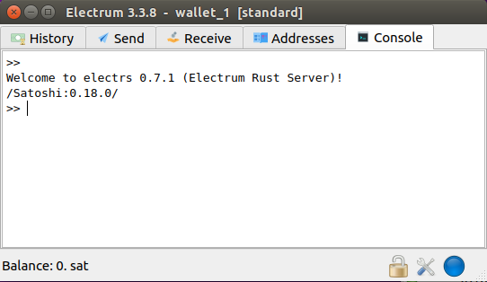

## Configure a Tor Hidden Service for Electrs

Tor needs to be active on the RaspiBlitz to use this method.  
No port forwarding or dynamicDNS required.

### Activate the Hidden Service in the RaspiBlitz terminal
* Open the Tor configuration file:  
`$ sudo nano /etc/tor/torrc`

* Insert the lines:
    ```bash
    # Hidden Service v3 for the Electrum desktop
    HiddenServiceDir /mnt/hdd/tor/electrs
    HiddenServiceVersion 3
    HiddenServicePort 50002 127.0.0.1:50002
    ```
* Restart Tor:   
`$ sudo systemctl restart tor` 

* Take note of the Tor address:  
`$ sudo cat /mnt/hdd/tor/electrs/hostname`

## Connect the Electrum wallet
### On a Linux PC

* Start electrum with the Tor Browser open (proxy on port 9150):  
`$ electrum --oneserver --server Tor_address.onion:50002:s --proxy socks5:127.0.0.1:9150`

* With Tor installed and running (proxy on port 9050):   
`$ electrum --oneserver --server Tor_address.onion:50002:s --proxy socks5:127.0.0.1:9050`

### Windows instructions:  
https://electrum.readthedocs.io/en/latest/tor.html#windows


Check for the blue dot when finished:



### [Electrum wallet on Android](https://play.google.com/store/apps/details?id=org.electrum.electrum&hl=en)
* Open [Orbot](https://play.google.com/store/apps/details?id=org.torproject.android&hl=en)
* Add Electrum to the Tor-Enabled Apps
* Start Electrum from Orbot
* In Electrum tap the dots in the right upper corner and select `Network`
* Switch `One-server mode:` `ON`
* In the `Server:` settings:   
    * Fill the `Host:` with the .onion address
    * Set the `Port:` to `50002` and press `OK`
* In the `Proxy:` settings set:
    * `Proxy mode` `socks5`
    * `Host` `127.0.0.1`
    * `Port` `9050` and press `OK`
* Now should see the `Status; 1 connections.` on the top

Note: if the Android Electrum wallet does not connect it worth trying to switch to a HiddenServiceVersion 2

### Based on:  
https://github.com/romanz/electrs/blob/master/doc/usage.md#tor-hidden-service
