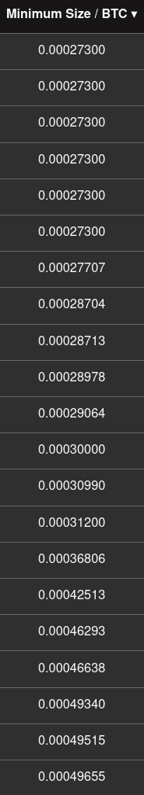

# A private flow through JoinMarket

Bitcoin privacy starts on the base layer where cooperative transactions with equal amount outputs - known as coinjoins - are used.
This document aims to provide an introduction to using JoinMarket, a decentralized, liquidity market based coinjoin implementation following basic good practices.

## Common definitions
### Mixdepth
* One of the accounts in the JoinMarket wallet.
* Abbreviated to m0 / m1 / m2 / m3 / m4
* All are derived from the same BIP32 and BIP39 compatible HD seed.

### Sweep
* It means sending one or multiple utxos without creating change.
* It is achieved by sending all utxos (except the ones frozen) from an account.
* The amount is not fixed and fees come off the sum of the inputs.

### Status labels
* applied automatically by JoinMarket via a simple transaction analyses

  #### `deposit`: output of a simple transaction to new address
  #### `cj-out`: one of the equal amount outputs
  #### `change-out`: one of the unique amount outputs from a cj
  #### `non-cj-change`: output of a transaction without equal amounts
  #### `reused`: a utxo on an address which has been used previously

### Orderbook
* Any platform collecting the public orders of the peers.
* General docs on the order book (including how to run without Bitcoin Core): https://github.com/JoinMarket-Org/joinmarket-clientserver/blob/master/docs/orderbook.md
* A public example: <https://nixbitcoin.org/orderbook>

### Minimum size to coinjoin
* The default is 100k sats (+/-10%) so that is a safe choice.
* On the example below offers start at 6 peers offering min 27300 sats.
* Running the Tumbler would require to start with a higher amount as the fees can take up a significant portion.

### Maximum size to coinjoin
* The max amount offered is limited by the wallet of each Maker.
* It is the highest amount in one single mixdepth (-0-10%).
* Multiple bitcoin amounts are offered by several (10+) peers.
* On the example below 21 peers offer 19+ BTC
### Screenshots taken from <https://nixbitcoin.org/orderbook> in March 2022.
* Click the top of the line to order by it's attribute

  
  
  

## The flow of funds

* First need to state that [one single coinjoin doesn't improve privacy much](https://github.com/JoinMarket-Org/joinmarket-clientserver/issues/1047#issuecomment-944995635).
* Participating in more coinjoins is essential. Find below the two main ways to achieve this.

## Running the Tumbler
* Using the Tumbler is a higher time preference option and usually is the best tool to use if the funds are needed in the near future - it can take multiple hours, up to days. 
* Multiple coinjoins are sent through the accounts including sweeping transactions at the start and at the end.
* Breaks up the deposited amounts and sends to at least 3 final addresses without leaving change behind.
* For the best outcome avoid merging between the final addresses.
* The initiator acts repeatedly as a Taker and [pays all the miner and coinjoin fees](https://github.com/JoinMarket-Org/joinmarket-clientserver/blob/master/docs/tumblerguide.md#a-note-on-fees);
* It is implemented in the JoinMarket-QT GUI and in the command line as the `tumbler.py`.
* For a detailed usage guide see:
  * https://github.com/JoinMarket-Org/joinmarket-clientserver/blob/master/docs/tumblerguide.md
* Video demonstration of the Tumbler function in QT GUI:
  * https://www.youtube.com/watch?v=hwmvZVQ4C4M&t=827s
* Discussed further in:
  * https://gist.github.com/chris-belcher/7e92810f07328fdfdef2ce444aad0968
  * https://joinmarket.me/blog/blog/the-445-btc-gridchain-case/

## Sending transactions manually and running the Yield Generator
### Deposit
* Send to a new address in m0 - could be any of the accounts, but suggesting using the first one for simplicity.
* Deposit a single or multiple coins from a single funding source at a time.
* Select the newly deposited coin(s) with freeze/unfreeze if there are others in the account.

### Sweep
* start with detaching the deposited coins from their history
* can send to the same account (could be any, but keep it simple)
* there is no change created, so there is need to separate the `cj-out` from the `change-out`

### Send or participate in multiple coinjoins
* Stretch out in time to avoid timing analyses.

* The Taker acts as the coinjoin coordinator
    * has the most privacy benefits
    * pays the fees (miner and coinjoin fees)

#### The Taker role
* the Taker is the initiator and coordinator of the coinjoin - takes the liquidity on offer.
* Send coinjoins to a new address in the next mixdepth.
* In a coinjoin multiple coins can be merged by sending custom amounts or sweeping.

#### The Maker role
* The Makers are offering their coins to be used in coinjoins - market makers.
* Being a Maker can be thought of as providing a service, but also comes with privacy benefits.
* Activate the Yield Generator (Maker / Earn) to start.
* To get selected more often it is best to have a a sizeable Fidelity Bond. See:
    * https://nixbitcoin.org/orderbook/fidelitybonds
    * https://github.com/JoinMarket-Org/joinmarket-clientserver/blob/master/docs/fidelity-bonds.md
* As a Maker the coins will circle through the accounts automatically:  
... m0 -> m1 -> m2 -> m3 -> m4 -> m0 -> m1 -> m2 -> m3 -> m4 ...
* Only the `cj-out`  propagates to the next account.
* The `change-out` stays behind in the same account where the funding utxo was.

### Leaving the JoinMarket wallet
#### When
* The more coinjoins the funds were through the better.
* Consider that the privacy benefit from coinjoins is breaking down with time as the peers are gradually exposed or clustered.
* If deposited only to m0 and followed the steps above all coins in m4 must have been through at least 5 coinjoins.
* In a long running, active Maker wallet some funds could have made multiple circles - there is no indication of this by default

#### How
##### Do
* Can only send (merge coins) from one account at a time.
* Send to multiple separate destinations (separate wallets with different purposes - not to be merged later).
* Sweep whole accounts or coins and don't leave change behind.
* Fund lightning nodes or send to cold storage via coinjoin(s).
* Pay with Payjoin to [BIP78 compatible wallets](https://en.bitcoin.it/wiki/PayJoin_adoption) to obfuscate the amount sent.

##### Don't
* Avoid sending out the whole amount which entered the wallet a few transactions ago all at once.
* Don't merge a change from a previous transaction when sending to a new destination.

## More Reading
* https://github.com/JoinMarket-Org/joinmarket-clientserver/tree/master/docs
* https://en.bitcoin.it/Privacy

## Questions and discussions:
* IRC through Matrix: https://matrix.to/#/#joinmarket:libera.chat
* Telegram: https://t.me/joinmarket.org
