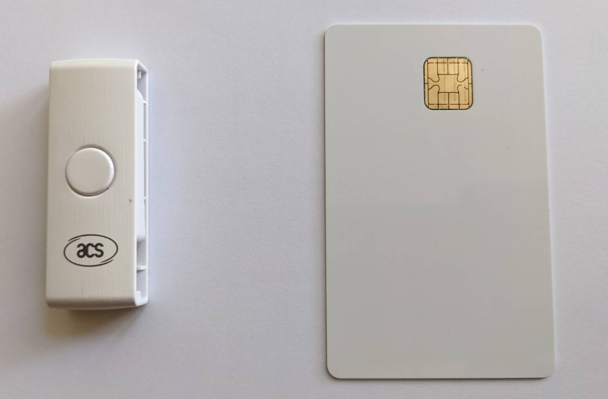
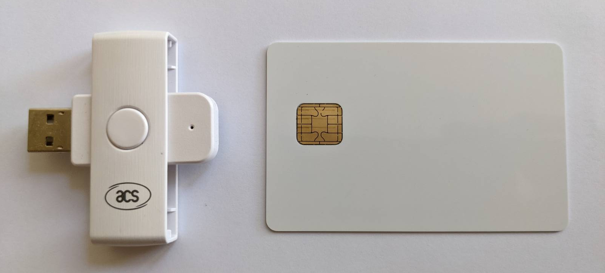
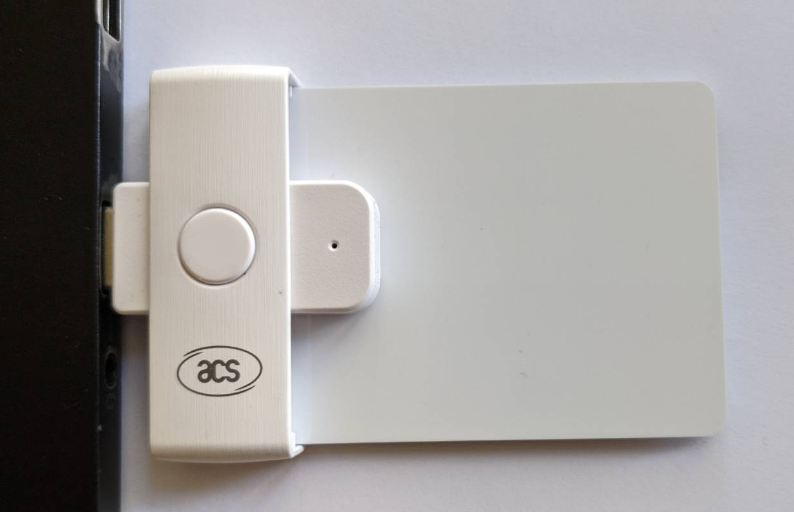
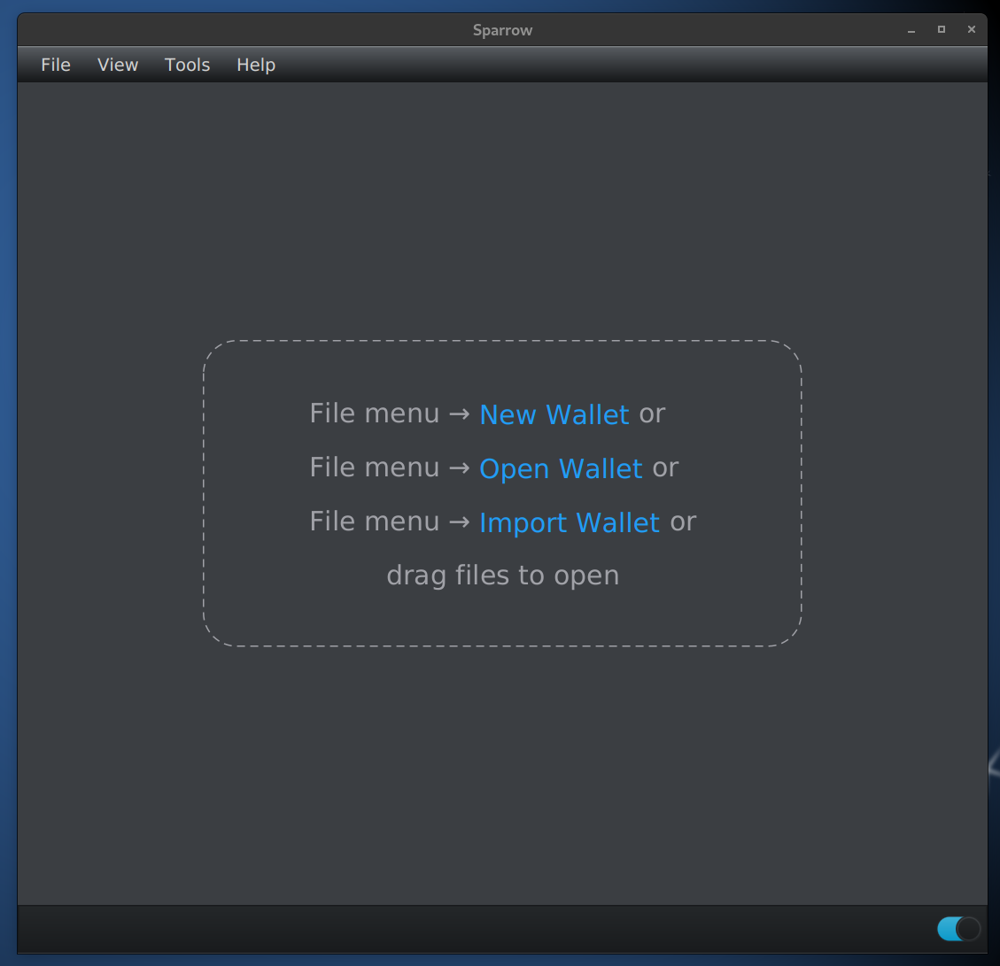
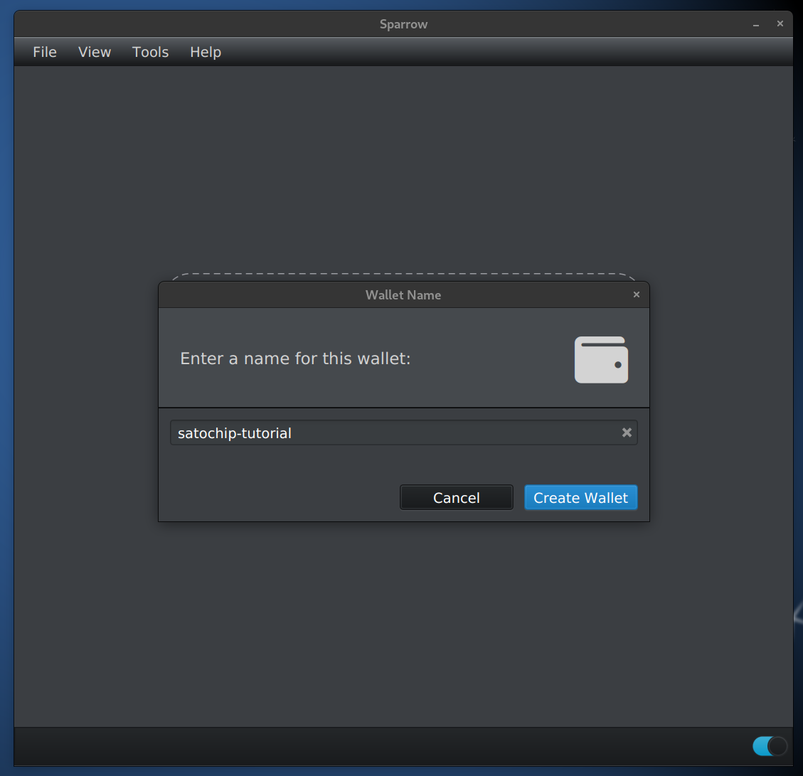
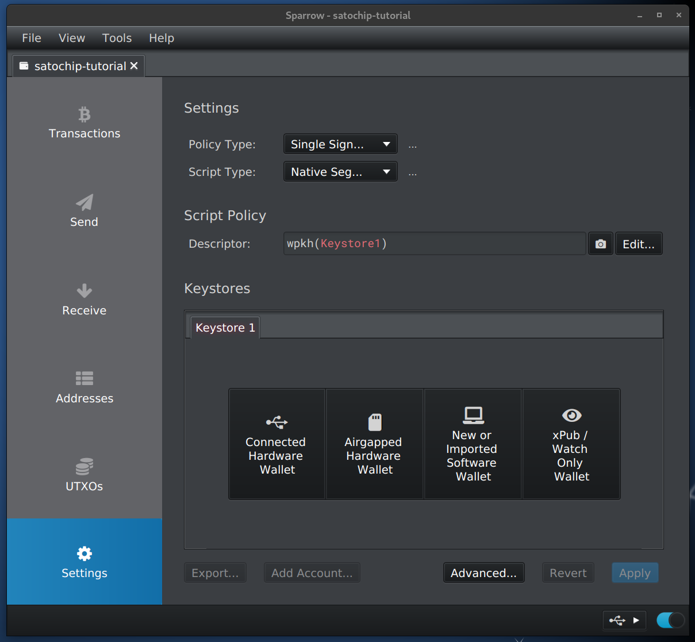
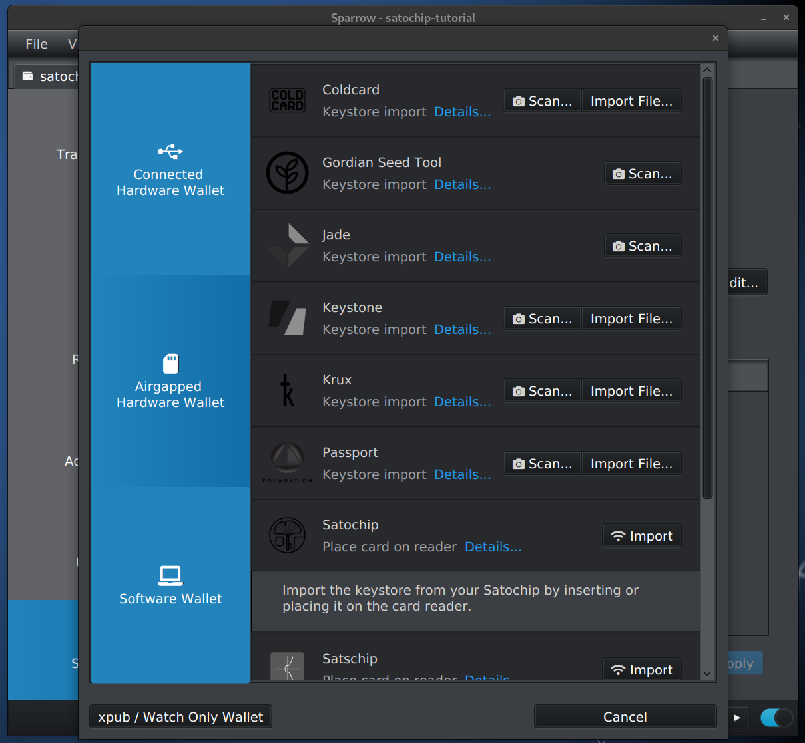
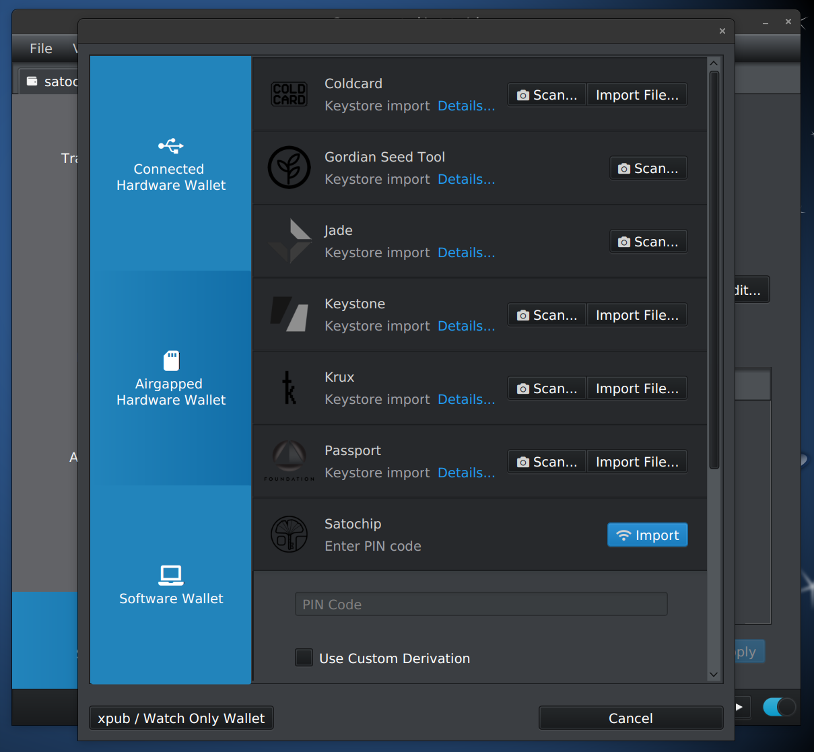
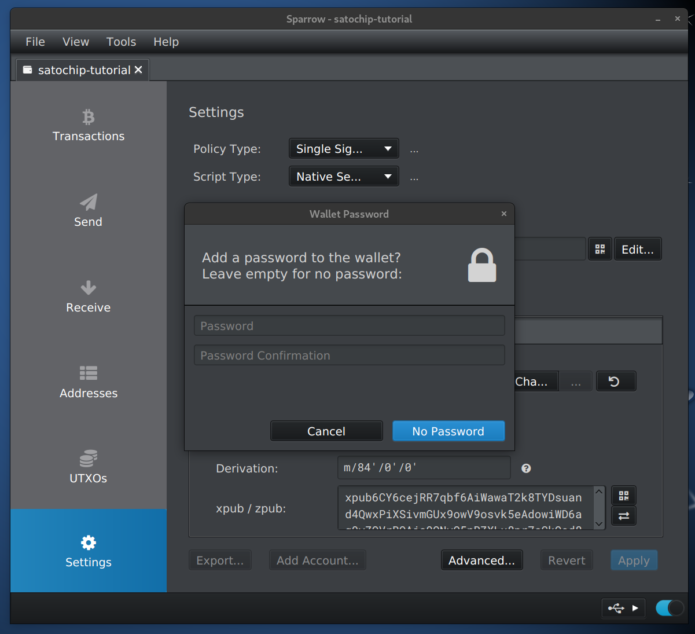
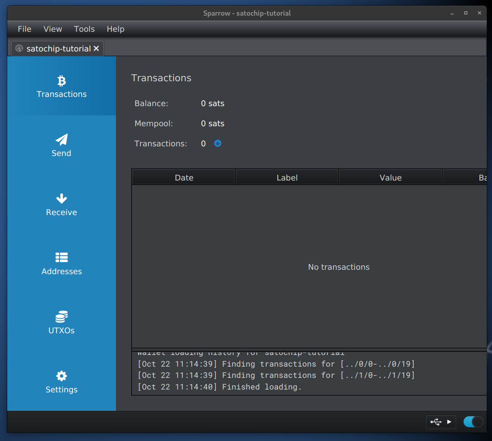

# Get started with Satochip

This setup is working out of the box on:
- [TailsOS](https://tails.net/) (can remain offline, but to see new transactions and balances needs an internet connection.)
- Debian 12
- Windows 10

## Connect the Satochip Card
* Open the Smartcard Reader by turning

* Plug in the card to the reader with the chip facing up
* Connet the Reader to a USB port
* The reader will start flashing

## Download and run Sparrow Wallet

* Find the files for your OS at [sparrowwallet.com/download](https://sparrowwallet.com/download/)
* Follow the steps to verify the downloaded binary. Can use Sparrow Wallet itself to do the verification once installed.
* If you don't have your own server use one public server which you know, eg.: `electrum.diynodes.com`

## Import the Satochip wallet to Sparrow Wallet

* Select `New Wallet`

* Type a name and `Create Wallet`

* Select `Airgapped Hardware Wallet`

* Click `Import` next to `Satochip`

* Enter the PIN code then click `Import` again

* Can see the details for the default derivation path. Save with `Apply`.

* It is optional to set a password to protect the read-only wallet on saved on the desktop.

* Select the `Transaction` tab on the left to see the balance and transaction history of the wallet on the card.

+ Make sure to wait for `Finished loading`

* In case transactions are missing despite a connected server can try increase the `Gap limit` in `Settings` -> `Advanced`

* Refer to the Sparrow Wallet documentation to transact using your Satochip: https://sparrowwallet.com/docs/coldcard-wallet.html#sending-bitcoin

## Reference:
* Find the original Satochip cards at: [satochip.io/product/satochip](https://satochip.io/product/satochip/)

* For the DIY version see this [gist](https://gist.github.com/openoms/510b2876cab19e15c4190456ea8aad82#file-satochip-javacard-applet-install)

* The Smartcard Reader pictured: ACS ACR39U-N1 PocketMate II USB Smart Card Reader
  * https://www.amazon.co.uk/dp/B0758TS5JR/
  * https://www.aliexpress.com/item/1005002034557322.html

* The Card pictured: JCOP Chip Card Dual Interface Chip Magnetic Stripe Java Card J3H145 (no NFC)
  * https://www.alibaba.com/product-detail/JCOP-Dual-Interface-Support-RSA4096-ECC_1600070838098.html
